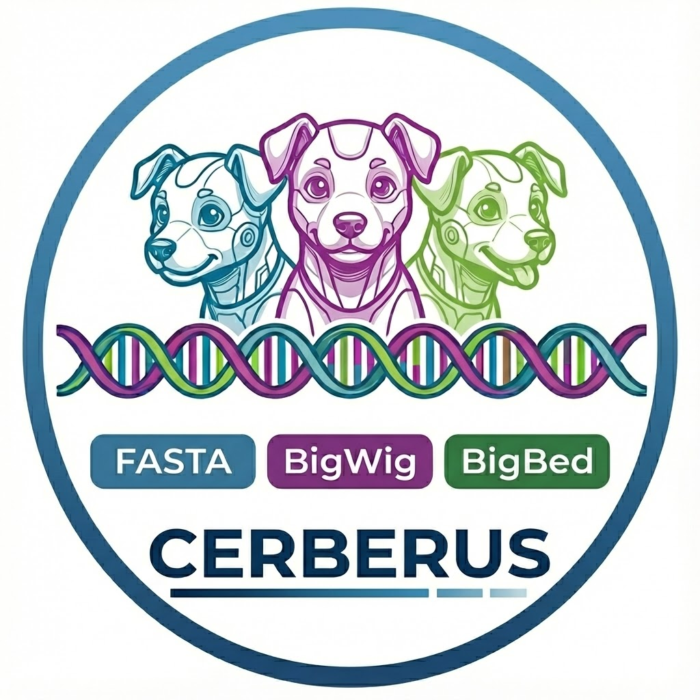

# cerberus



Attentive multi-headed and highly trained companion to sequence-to-function deep-learning models.

Cerberus is a PyTorch-based framework for genomic sequence-to-function (S2F) model training. It implements efficient data loading infrastructure for handling genomic intervals, DNA sequences (FASTA), and functional signal tracks (BigWig/BigBed). The library provides composable sampling strategies—including sliding windows and weighted multi-source mixing—and on-the-fly data transformations such as jittering and reverse-complement augmentation. By abstracting these components into a unified pipeline, Cerberus facilitates the training of deep learning models with complex input/output architectures on large-scale genomic datasets.

## Installation

```bash
TODO:
```
