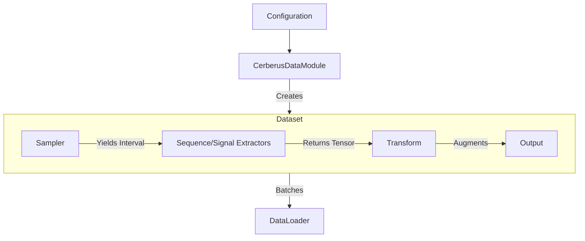

# Cerberus Overview

Cerberus is a PyTorch-based framework designed for genomic sequence-to-function (S2F) deep learning. It addresses the challenge of efficiently feeding massive genomic datasets—spanning DNA sequences, functional signal tracks (e.g., ChIP-seq, ATAC-seq), and genomic annotations—into modern neural network architectures.

## High-Level Architecture

The core of Cerberus is built around the separation of **sampling** (where to look) from **extraction** (what to load). This decoupling allowing for flexible training strategies without rewriting data loading logic.

### Key Components

1.  **CerberusDataModule**: The top-level orchestrator (PyTorch Lightning DataModule). It manages the lifecycle of training, validation, and testing, handling data splitting and multi-process worker initialization.
2.  **CerberusDataset**: A PyTorch Dataset that integrates:
    *   **Samplers**: Determine the genomic intervals to query (e.g., sliding windows across chromosomes or specific peaks).
    *   **Extractors**: Retrieve data for a given interval.
        *   **SequenceExtractor**: Fetches DNA sequences (one-hot encoded) from FASTA files.
        *   **SignalExtractor**: Fetches continuous signal tracks from BigWig files.
    *   **Transforms**: Apply on-the-fly augmentations like jittering, reverse-complementing, and cropping.
3.  **CerberusModule**: The PyTorch Lightning Module that wraps the user's neural network. It handles the training loop, optimization (via `timm`), learning rate scheduling, loss calculation, and metric logging.

### Data Flow

## Key Features

*   **Efficient Data Loading**: Supports both on-disk (lazy loading) and in-memory modes for sequences and signals, optimizing for speed or memory usage as needed.
*   **Composable Sampling**: Easily switch between training on specific regions (e.g., peaks) or scanning the entire genome (`SlidingWindow`), or mix multiple strategies (`MultiSampler`).
*   **Reproducibility**: Integrated seed management ensures deterministic data splitting and augmentation, even across multi-process workers.
*   **Flexible Configuration**: Define your genome, data inputs, and sampling strategy via clear configuration dictionaries.
